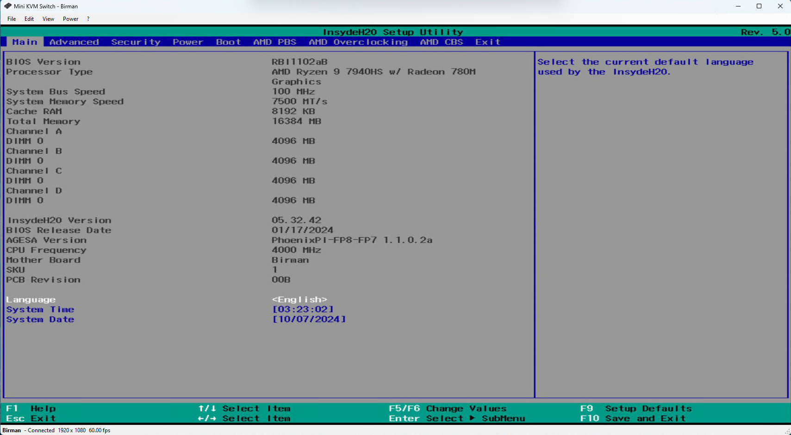

# MiniKvm_public
This repro contains all the code and documentation for the MiniKvm project and the CH9329 controller.


### What is the MiniKvm project?
The MiniKvm is a personal project designed and implemented by Andrea Allievi (AaLl86) for "totally" remote 
controlling machines from the Firmware to the OS execution, allowing the author to work remotely from Italy
on test machines located elsewhere.

There are already similar projects around the web, like:
- [TiniKvm](https://tinypilotkvm.com/)
- [PiKvm](https://pikvm.org/)
- Server KVMs, like Vertiv, Digi AnywhereUSB and others (very expensive)

All those solution were not a good fit for the author since:
1. The majority of them were Raspberry PI based
1. Maximum speed and resolution was not acceptable (24 Fps max)
1. They allow you only to control one target at time
1. They were kind of expensive

Hence I started to design my own one, based on Video capture cards, Ch9392 controller and relays 
(connected to Arduino or the GPIO interface of the motherboard).

### MiniKvm goals
- Being able to transmit Video, keyboard and mouse signal through Internet (and possibly audio)
- Power on, off, and reset the target
- Being fast enough to not see significant slowdowns (target: 60Fps)
- OS independent. The project should not require anything in the target
- Generic enough to be used with multiple Power switch implementation (there are plenty)
- Cheap enough to be usable by everyone (try to stay under the 100 USD base price)


### What do you need for run this black box
Here are the needed material for running a base version of the MiniKvm (no power switch
1. [FT232RL USB to serial](https://www.amazon.com/gp/product/B073RGLD85) to communicate with the CH9392  (18.90 $)
1. [Graphics capture acquisition card (4K / FULLHD 60 Hz)](https://www.amazon.com/gp/product/B0BZSRTT1X) (25.99 $)
1. [CH9392 Chip](https://www.aliexpress.us/item/3256805024535658.html) (around 2.00 $)

The stuff listed above will allow you to try a basic (but fully working) MiniKvm for a total of 47 USD.
If you would like to add also the power switch capability, or to design a always on device that controls
all of your target, you just need the following:

1. For sharing an HDMI port in the target [HDMI Splitter](https://www.amazon.com/Splitter-Adapter-HDMIHDMI-Female-Support/dp/B08RXK5K8R/)  (10.59 $)
1. For power switching 4 different targets [5V Relay](https://www.amazon.com/ANMBEST-Channel-Optocoupler-Expansion-Raspberry/dp/B08PP8HXVD/) (9.90 $
1. [Relay box 125 x 80 x 35mm](https://www.amazon.com/dp/B0BYBL344T/) (12.99 $)
1. [Arduino uno (for controlling the Relay)](https://store.arduino.cc/products/arduino-uno-rev3) (€29,30)
1. [Aaeon board (perfect as host, it has GPIO ports)](https://up-shop.org/up-xtreme-i12-series.html) (399.00$)

### Content of this repository
This repository contains the following:
- **CH9329.cs** - C Sharp code that implement the Protocol transmission mode 
for the CH9329 controller connected through a serial port.
- **Specs** - CH9329 specifications, Chip serial communication protocol (translated in English) and 
test tools
- **Arduino** - Includes the Power switch implementation using an Arduino Uno controller, and some 
other (dumb) trials with it :-)
- **Release** - Includes compiled version of the MiniKvm project targeting the .Net framework 8

### Source code license
The source code in this repository is published with a "free-to-use" license, similar to the GPL one:
```
/*
 * This program is free software: you can redistribute it and/or modify
 * it under the terms of the GNU General Public License as published by
 * the Free Software Foundation, either version 3 of the License, or
 * (at your option) any later version.
 *
 * This program is distributed in the hope that it will be useful,
 * but WITHOUT ANY WARRANTY; without even the implied warranty of
 * MERCHANTABILITY or FITNESS FOR A PARTICULAR PURPOSE. See the
 * GNU General Public License for more details.
 *
 * You should have received a copy of the GNU General Public License
 * along with this program. If not, see <https://www.gnu.org/licenses/>.
 */
 ```

 The only modification that is required is to inform and list me (AaLl86, the author) in case you 
 are going to use or modify the code... but, at the end of the day, a part of that, you can do 
 whatever you want at your own risk with the code.

 I maintain also a **PRIVATE** Github repository for the MiniKvm project:
 https://github.com/AaLl86/MiniKvm

 Since the MiniKvm is still under active development, since I am not really a fun open-sourcing 
 everything and I do not know the implications of it, it is private, but you can still collaborate
 (check, modify and reuse the code. I would love to have more people on it) by sending a mail
 or a Twitter message to me (aall86@gmail.com).

 I will sooner or later write a blog post about how this thing works under the hood.
